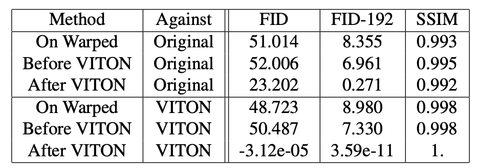

# README

# Cloth try-on with style transfer

Thiso project proposes a virtual try-on network with style synthesis. It generates realistic images of a user wearing clothes with specific styles and textures. The network responds to the growing need for virtual try-ons due to the increasing online fashion retail and the constraints it presents. It aims to tackle the challenge of producing high-quality images without relying heavily on human parsers and expensive hardware for 3D data collection.

## Introduction

This project targets the online retail fashion industry, which has seen a significant growth due to factors such as the shift towards digital channels and the limitations imposed by the pandemic. It seeks to address the challenge customers face when they want to try clothes in different styles or patterns virtually. The solution provided is both cost-effective and efficient.

## Dataset and Training

This project uses the VITON dataset, which includes 14221 pairs of person/clothes training images and 2032 pairs for testing. The training dataset is expanded using techniques like human parsing and obtaining a dense representation of pose from OpenPose and DensePose.

## Methodology

This project is based on a parser-free teacher-student model for image-based virtual try-on, which combines StyleGAN with appearance flow for enhanced performance. The teacher model processes raw human images into segmented body parts using a parser and generates keypoints using the OpenPose library. These are then combined with a cloth product image and fed into a feature extraction network comprising convolutional and pooling layer pairs. The student model, similar to the teacher model, accepts input from the teacher model's outputs. To achieve style synthesis, we use Neural Style Transfer (NST), which takes a content image and a style/pattern image, and blends them together to transform the content image in the style of the pattern image. We use a VGG with 19 layers for NST, and employ gradient descent with the LBFGS optimizer to minimize the weighted sum of content loss and style loss. Furthermore, we implement Simple Segmented Neural Style Transfer (SSNST) to eliminate potential background noise in the images. Finally, we propose three methods for virtual try-on with style transfer: SSNST applied on the warped image, SSNST applied before running the virtual try-on process, and normal NST applied after the virtual try-on process.

## Results and Evaluation

The results were evaluated using 500 randomly selected pairs from the testing data. The evaluation metrics used are the Frechet Inception Distance (FID) and Structural Similarity (SSIM). The findings suggest that applying neural style transfer After VITON resulted in the best performance with the lowest FID scores and the highest SSIM scores.

## Conclusion

While we encountered some surprising results, this project demonstrates promising potential for a practical solution for the fashion industry. The findings suggest that the model is a step towards solving the challenge of providing customers with the opportunity to virtually try on clothes in various styles and patterns.

.png)

.png)

.png)

.png)

